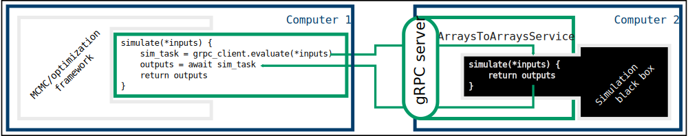

[](https://pypi.org/project/pytensor-federated)
[](https://github.com/michaelosthege/pytensor-federated/actions)
[](https://codecov.io/gh/michaelosthege/pytensor-federated)

# `pytensor-federated`
This package implements federated computing with [PyTensor](https://github.com/pymc-devs/pytensor).

Using `pytensor-federated`, differentiable cost functions can be computed on federated nodes.
Inputs and outputs are transmitted in binary via a bidirectional gRPC stream.

A client side `LogpGradOp` is provided to conveniently embed federated compute operations in PyTensor graphs such as a [PyMC](https://github.com/pymc-devs/pymc) model.

The example code implements a simple Bayesian linear regression to data that is "private" to the federated compute process.

Run each command in its own terminal:

```bash
python demo_node.py
```

```bash
python demo_model.py
```

## Architecture
`pytensor-federated` is designed to be a very generalizable framework for federated computing with gRPC, but it comes with implementations for PyTensor, and specifically for use cases of Bayesian inference.
This is reflected in the actual implementation, where the most basic gRPC service implementation -- the `ArraysToArraysService` -- is wrapped by a few implementation flavors, specifically for common use cases in Bayesian inference.

At the core, everything is built around an `ArraysToArrays` gRPC service, which takes any number of (NumPy) arrays as parameters, and returns any number of (NumPy) arrays as outputs.
The arrays can have arbitrary `dtype` or `shape`, as long as the buffer interface is supported (meaning `dtype=object` doesn't work, but `datetime` dtypes are ok).


This `ArraysToArraysService` can be used to wrap arbitrary model functions, thereby enabling to run model simulations and MCMC/optimization on different machines.
The protobuf files that specify the data types and gRPC interface can be compiled to other programming languages, such that the model implementation could be C++, while MCMC/optimization run in Python.



For the Bayesian inference or optimization use case, it helps to first understand the inputs and outputs of the undelying computation graph.
For example, parameter estimation with a differential equation model requires...
* `observations` to which the model should be fitted
* `timepoints` at which there were observations
* parameters (including initial states) `theta`, some of which are to be estimated

From `timepoints` and parameters `theta`, the `model` predicts `trajectories`.
Together with `observations`, these predictions are fed into some kind of likelihood function, which produces a scalar log-likelihood `log-likelihood` as the output.

Different sub-graphs of this example could be wrapped by an `ArraysToArraysService`:
* `[theta,] -> [log-likelihood,]`
* `[timepoints, theta] -> [trajectories,]`
* `[timepoints, observations, theta] -> [log-likelihood,]`


If the entire model is differentiable, one can even return gradients.
For example, with a linear model: `[slope, intercept] -> [LL, dLL_dslope, dLL_dintercept]`.

The role of PyTensor here is purely technical:
PyTensor is a graph computation framework that implements auto-differentiation.
Wrapping the `ArraysToArraysServiceClient` in PyTensor `Op`s simply makes it easier to build more sophisticated compute graphs.
PyTensor is also the computatation backend for PyMC, which is the most popular framework for Bayesian inference in Python.


## Installation & Contributing
```bash
conda env create -f environment.yml
```

Additional dependencies are needed to compile the [protobufs](./protobufs/):

```bash
conda install -c conda-forge protobuf
pip install --pre betterproto[compiler]
```

```bash
python protobufs/generate.py
```

Set up `pre-commit` for automated code style enforcement:

```bash
pip install pre-commit
pre-commit install
```
